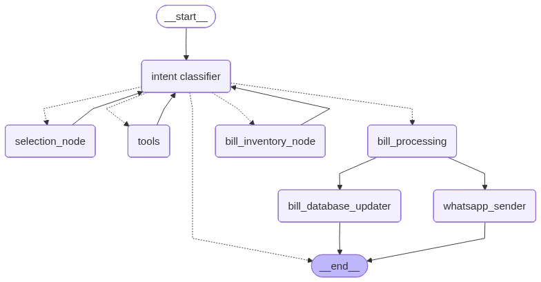

# Shop Agent

> AI-powered inventory copilot that lets you ask natural-language questions and run safe CRUD operations on your shop database. This app is developed and deployed in order to help my family
manage better the products on their store.

## Tech Stack


## Highlights
- Conversational agent built with LangGraph + LangChain, powered by Google Gemini 2.5 Flash.
- Supabase Postgres backend with typed runtime context so tools always receive a ready-to-use client.
- Streamlit UI with sticky chat history and session-scoped thread IDs for multi-turn memory.
- Command-line loop (`backend/main.py`) for quick local testing without the UI.
- Guard rails in `system_prompt.py` + curated toolset to prevent unsafe SQL and enforce workflows.

## Architecture
1. The Streamlit app (`frontend/interface.py`) or CLI (`backend/main.py`) collects a user prompt.
2. `ShopAgent` wires a Gemini chat model, tool definitions (`backend/tools.py`), and LangGraph checkpointing to keep track of context.
3. A `RuntimeContex` object injects the active Supabase client into LangGraph’s runtime so tools can talk to the database without global state.
4. Tool outputs stream back through LangGraph; only final AI responses get rendered to the UI/chat loop.

```
User → Streamlit/CLI → ShopAgent (LangGraph) → Tools ↔ Supabase
```

## Graph Representation
Visual overview of the LangGraph workflow used by `ShopAgent`.



## Project Tour
```
Shop_Agent/
├── backend/
│   ├── agent.py              # ShopAgent wiring (LLM + tools + context)
│   ├── main.py               # Simple CLI runner for quick prompts
│   ├── tools.py              # Supabase CRUD + analytics helpers
│   ├── system_prompt.py      # Operating instructions for the agent
│   ├── env_checker.py        # Loads .env and validates required keys
│   ├── runtime_context.py    # Dataclass injected into LangGraph runtime
│ 
├── frontend/
│   └── interface.py          # Streamlit chat UI with session/thread state
└── .gitignore
```

## Getting Started
### 1. Prerequisites
- Python 3.11+
- A Supabase project with a `products` table (`product_name`, `quantity`, `price_per_piece`, `product_code`, `date_updated`) and the `get_total_inventory_value` RPC.
- Gemini API access (Google AI Studio or Google Cloud project).

### 2. Configure environment variables
1. Copy the template:  
   `cp backend/example.env backend/.env`
2. Fill in your own credentials. Never commit real keys.

| Variable | Purpose |
| --- | --- |
| `GEMINI_API_KEY` | Auth token for Google Gemini 2.5 Flash. |
| `PROJECT_URL` | Supabase project URL (https://*.supabase.co). |
| `PROJECT_API` | Service role or anon key with access to the `products` table. |
| `LANGSMITH_*` | Optional tracing/debugging telemetry. |

`backend/env_checker.py` automatically loads `.env` and double-checks it against `example.env` so missing keys fail fast.

### 3. Install dependencies
```pwsh
cd backend
python -m venv .venv
.venv\Scripts\activate
pip install --upgrade pip
pip install streamlit langchain langchain-google-genai langgraph supabase python-dotenv
```
> Tip: You can also `pip install -e langGraph` if you want to hack on the bundled LangGraph fork.

### 4. Run the CLI agent
```pwsh
cd backend
python main.py
```
Type `exit` to close the loop.

### 5. Launch the Streamlit interface
```pwsh
cd frontend
streamlit run interface.py
```
The sidebar reset button clears conversation state and spins up a fresh LangGraph thread ID.

## Tool Belt
| Tool | Description |
| --- | --- |
| `query_table(product_name)` | Reads the latest quantity for a given product (case-insensitive). |
| `all_names_selector` | Lists every product name to help with fuzzy matching. |
| `quantity_updater` | Adds/subtracts stock and timestamps the update. |
| `delete_record` | Removes a product after verifying it exists. |
| `insert_product` | Adds a new product row, auto-generating a code if needed. |
| `stock_value` | Calls the Supabase RPC to total inventory value. |
| `general_information` | Returns every column for a product, useful for audits. |

The `system_prompt` forces the agent to choose the correct tool workflow (e.g., read → update, read → delete) and never issue raw SQL.
